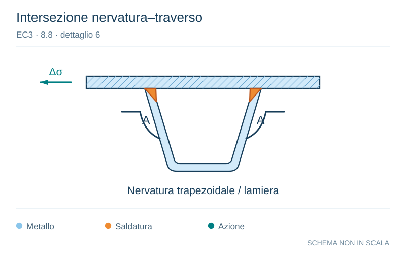

# EC3 · 8.8 · dettaglio 6

[Pagina estratta](../pages/ec3-035.md) · [PDF originale](../../sources/ec3.pdf#page=35)

**Intersezione nervatura–traverso.** Disegno vettoriale non in scala. [Apri / scarica il disegno SVG](../../assets/illustrations/ec3-035-t01-d01.svg).

Il blu rappresenta gli elementi metallici, l’arancio le saldature e il turchese le azioni. Simboli e proporzioni hanno funzione schematica; classi, dimensioni limite e condizioni applicabili sono quelle riportate nella fonte.

## Classificazione riportata

71

## Descrizione e condizioni

6) Sezione critica nell’anima
della trave dovuta a tagli.

## Requisiti e note

6) Valutazione basata
sull’intervallo di variazione della
tensione che tiene conto degli
effetti Vierendeel.
Nota    Nel   caso     in    cui
           l’intervallo  di variazione
          della     tensione    è
        determinato secondo    il
        punto  9.4.2.2(3)   della
      EN 1993-2, può essere
          utilizzata la categoria di
          particolare 112.

> Estrazione documentale da verificare. Le categorie non sono valori di progetto pronti per il calcolo. Celle condivise e varianti non vanno separate dalle condizioni.

## Contesto della classificazione

[Celle della tabella in Markdown](../tables/ec3-035-t01.md) · [Tabella nel PDF di riferimento](../../sources/ec3.pdf#page=35).
