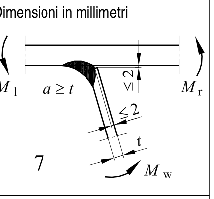
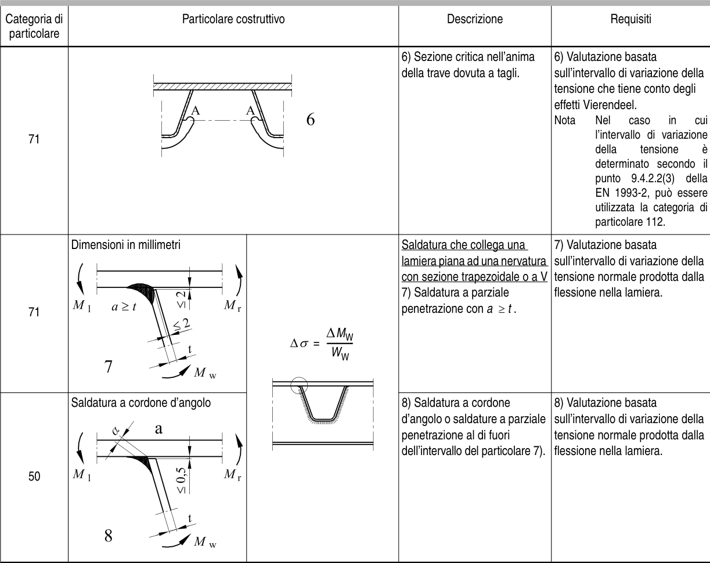

# EC3 · 8.8 · dettaglio 7

[Pagina estratta](../pages/ec3-035.md) · [PDF originale](../../sources/ec3.pdf#page=35)

## Classificazione riportata

D

71
S

50

## Descrizione e condizioni

Saldatura che collega una
lamiera piana ad una nervatura

lamiera piana ad una nervatura
con sezione trapezoidale o a V

7) Saldatura a parziale
penetrazione con a ≥ t .

8) Saldatura a cordone
d’angolo o saldature a parziale
penetrazione al di fuori
dell’intervallo del particolare 7).

## Requisiti e note

7) Valutazione basata
sull’intervallo di variazione della
tensione normale prodotta dalla
flessione nella lamiera.

8) Valutazione basata
sull’intervallo di variazione della
tensione normale prodotta dalla
flessione nella lamiera.

> Estrazione documentale da verificare. Le categorie non sono valori di progetto pronti per il calcolo. Celle condivise e varianti non vanno separate dalle condizioni.

## Tabella completa

