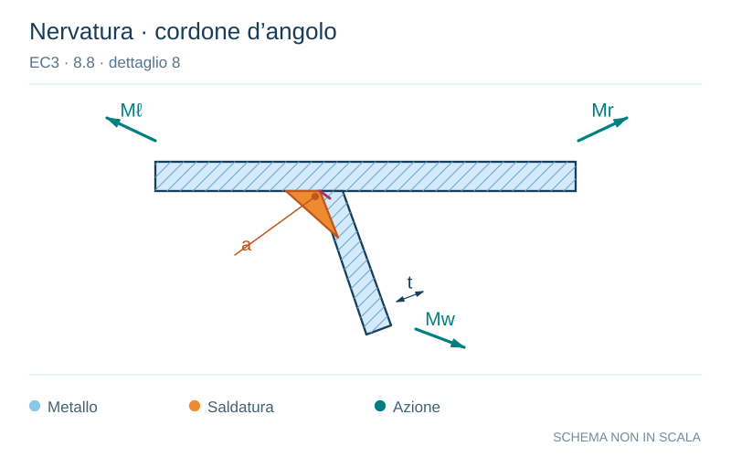

# EC3 · 8.8 · dettaglio 8

[Pagina estratta](../pages/ec3-035.md) · [PDF originale](../../sources/ec3.pdf#page=35)

**Nervatura · cordone d’angolo.** Disegno vettoriale non in scala. [Apri / scarica il disegno SVG](../../assets/illustrations/ec3-035-t01-d02-02.svg).

Il blu rappresenta gli elementi metallici, l’arancio le saldature e il turchese le azioni. Simboli e proporzioni hanno funzione schematica; classi, dimensioni limite e condizioni applicabili sono quelle riportate nella fonte.

## Classificazione riportata

D

71
S

50

## Descrizione e condizioni

Saldatura che collega una
lamiera piana ad una nervatura

lamiera piana ad una nervatura
con sezione trapezoidale o a V

7) Saldatura a parziale
penetrazione con a ≥ t .

8) Saldatura a cordone
d’angolo o saldature a parziale
penetrazione al di fuori
dell’intervallo del particolare 7).

## Requisiti e note

7) Valutazione basata
sull’intervallo di variazione della
tensione normale prodotta dalla
flessione nella lamiera.

8) Valutazione basata
sull’intervallo di variazione della
tensione normale prodotta dalla
flessione nella lamiera.

> Estrazione documentale da verificare. Le categorie non sono valori di progetto pronti per il calcolo. Celle condivise e varianti non vanno separate dalle condizioni.

## Contesto della classificazione

[Celle della tabella in Markdown](../tables/ec3-035-t01.md) · [Tabella nel PDF di riferimento](../../sources/ec3.pdf#page=35).
