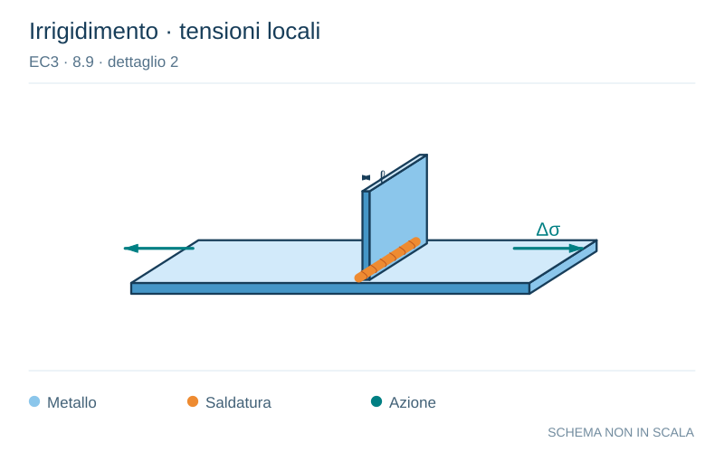

# EC3 · 8.9 · dettaglio 2

[Pagina estratta](../pages/ec3-036.md) · [PDF originale](../../sources/ec3.pdf#page=36)

**Irrigidimento · tensioni locali.** Disegno vettoriale non in scala. [Apri / scarica il disegno SVG](../../assets/illustrations/ec3-036-t01-d01.svg).

Il blu rappresenta gli elementi metallici, l’arancio le saldature e il turchese le azioni. Simboli e proporzioni hanno funzione schematica; classi, dimensioni limite e condizioni applicabili sono quelle riportate nella fonte.

## Classificazione riportata

56

## Descrizione e condizioni

2) Connessione di correnti longitudinali
continui a traversi
      ∆Ms
∆σ =    --------------
        Wnet,s
      ∆Vs
∆τ =    -----------------
         Aw,net,s
Verificare anche l’intervallo di
variazione della tensione tra i correnti
come definito nella EN 1993-2.

## Requisiti e note

2) Valutazione basata combinando
l’intervallo di variazione della tensione
tangenziale ∆τ e l’intervallo di variazione
della tensione normale ∆σ nell’anima del
traverso come un intervallo di variazione
della tensione equivalente:
        1∆σeq =   ( ∆σ+  ∆σ2 + 4∆τ2 )                        2--

> Estrazione documentale da verificare. Le categorie non sono valori di progetto pronti per il calcolo. Celle condivise e varianti non vanno separate dalle condizioni.

## Contesto della classificazione

[Celle della tabella in Markdown](../tables/ec3-036-t01.md) · [Tabella nel PDF di riferimento](../../sources/ec3.pdf#page=36).
