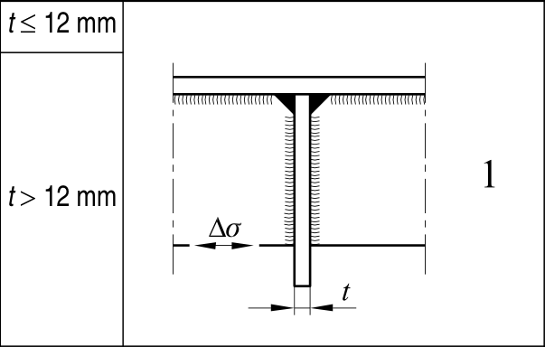

# EC3 · 8.9 · dettaglio 1

[Pagina estratta](../pages/ec3-036.md) · [PDF originale](../../sources/ec3.pdf#page=36)

## Classificazione riportata

80
71

## Descrizione e condizioni

1) Connessione di correnti longitudinali
a traversi.

## Requisiti e note

1) Valutazione basata sull’intervallo di
variazione della tensione normale ∆σ nel
corrente.

> Estrazione documentale da verificare. Le categorie non sono valori di progetto pronti per il calcolo. Celle condivise e varianti non vanno separate dalle condizioni.

## Tabella completa

