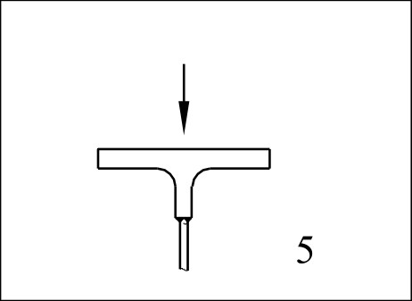

# EC3 · 8.10 · dettaglio 5

[Pagina estratta](../pages/ec3-037.md) · [PDF originale](../../sources/ec3.pdf#page=37)

## Classificazione riportata

71

## Descrizione e condizioni

5) Ala di sezione a T con giunzione saldata
a T a completa penetrazione.

## Requisiti e note

5) Intervallo di variazione della tensione
verticale di compressione ∆σvert nell’anima
dovuto ai carichi trasmessi dalla ruota.

> Estrazione documentale da verificare. Le categorie non sono valori di progetto pronti per il calcolo. Celle condivise e varianti non vanno separate dalle condizioni.

## Tabella completa

