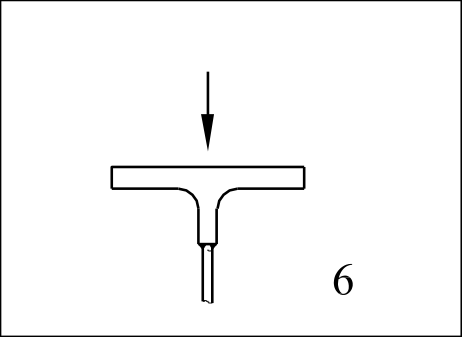
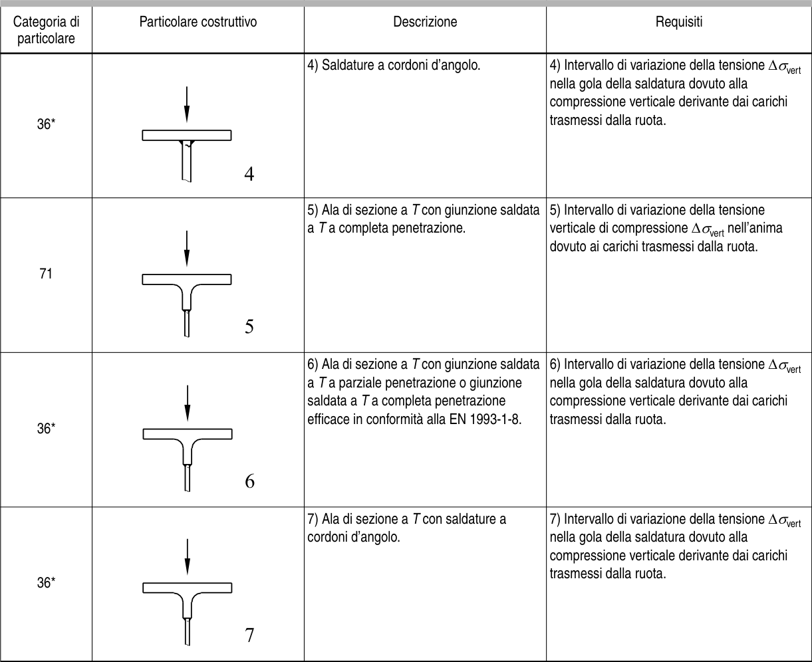

# EC3 · 8.10 · dettaglio 6

[Pagina estratta](../pages/ec3-037.md) · [PDF originale](../../sources/ec3.pdf#page=37)

## Classificazione riportata

36*

## Descrizione e condizioni

6) Ala di sezione a T con giunzione saldata
a T a parziale penetrazione o giunzione
saldata a T a completa penetrazione
efficace in conformità alla EN 1993-1-8.

## Requisiti e note

6) Intervallo di variazione della tensione ∆σvert
nella gola della saldatura dovuto alla
compressione verticale derivante dai carichi
trasmessi dalla ruota.

> Estrazione documentale da verificare. Le categorie non sono valori di progetto pronti per il calcolo. Celle condivise e varianti non vanno separate dalle condizioni.

## Tabella completa

