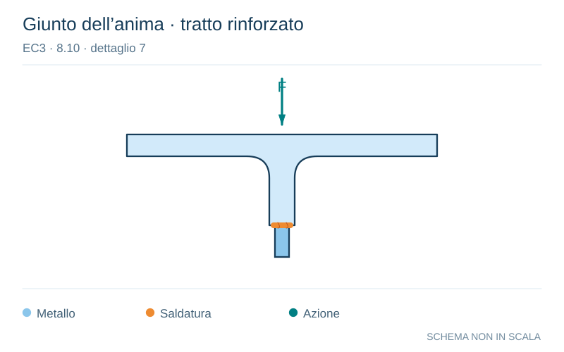

# EC3 · 8.10 · dettaglio 7

[Pagina estratta](../pages/ec3-037.md) · [PDF originale](../../sources/ec3.pdf#page=37)

**Giunto dell’anima · tratto rinforzato.** Disegno vettoriale non in scala. [Apri / scarica il disegno SVG](../../assets/illustrations/ec3-037-t01-d04.svg).

Il blu rappresenta gli elementi metallici, l’arancio le saldature e il turchese le azioni. Simboli e proporzioni hanno funzione schematica; classi, dimensioni limite e condizioni applicabili sono quelle riportate nella fonte.

## Classificazione riportata

36*

## Descrizione e condizioni

7) Ala di sezione a T con saldature a
cordoni d’angolo.

## Requisiti e note

7) Intervallo di variazione della tensione ∆σvert
nella gola della saldatura dovuto alla
compressione verticale derivante dai carichi
trasmessi dalla ruota.

> Estrazione documentale da verificare. Le categorie non sono valori di progetto pronti per il calcolo. Celle condivise e varianti non vanno separate dalle condizioni.

## Contesto della classificazione

[Celle della tabella in Markdown](../tables/ec3-037-t01.md) · [Tabella nel PDF di riferimento](../../sources/ec3.pdf#page=37).
