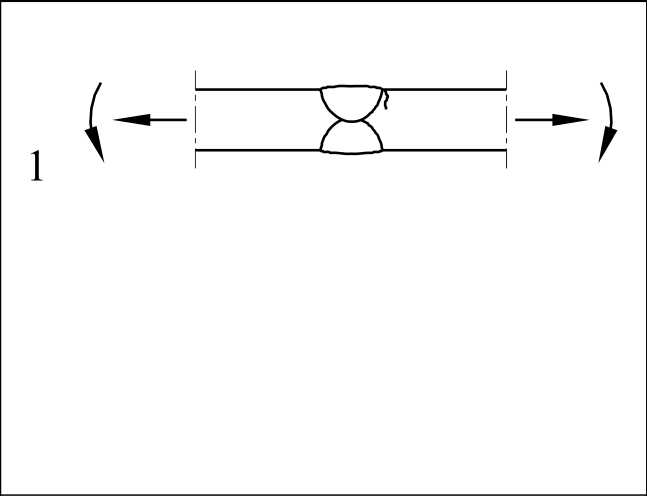
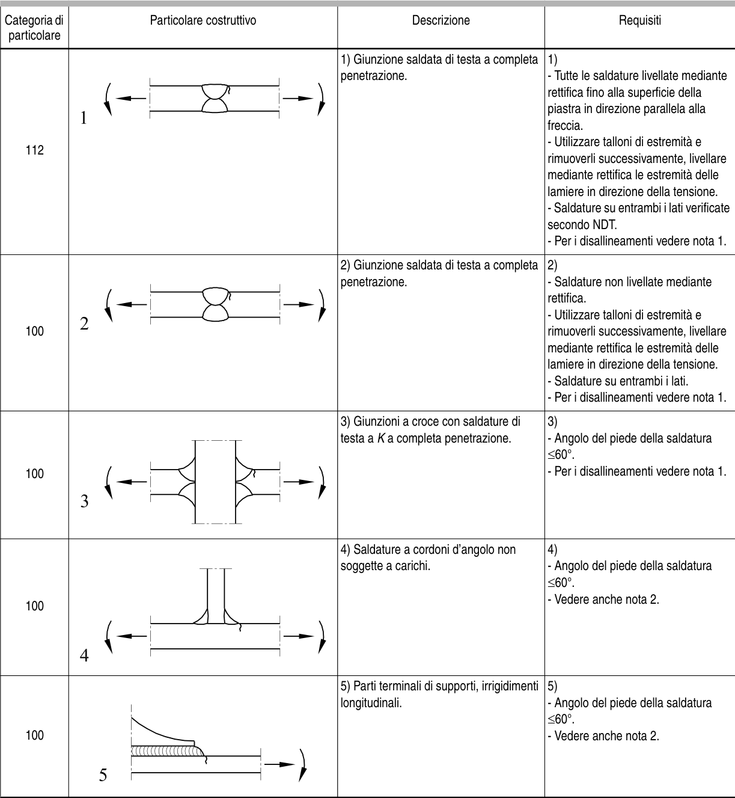

# EC3 · B.1 · dettaglio 1

[Pagina estratta](../pages/ec3-041.md) · [PDF originale](../../sources/ec3.pdf#page=41)

## Classificazione riportata

112

## Descrizione e condizioni

1) Giunzione saldata di testa a completa
penetrazione.

## Requisiti e note

1)
- Tutte le saldature livellate mediante
rettifica fino alla superficie della
piastra in direzione parallela alla
freccia.
- Utilizzare talloni di estremità e
rimuoverli successivamente, livellare
mediante rettifica le estremità delle
lamiere in direzione della tensione.
- Saldature su entrambi i lati verificate
secondo NDT.
- Per i disallineamenti vedere nota 1.

> Estrazione documentale da verificare. Le categorie non sono valori di progetto pronti per il calcolo. Celle condivise e varianti non vanno separate dalle condizioni.

## Tabella completa

