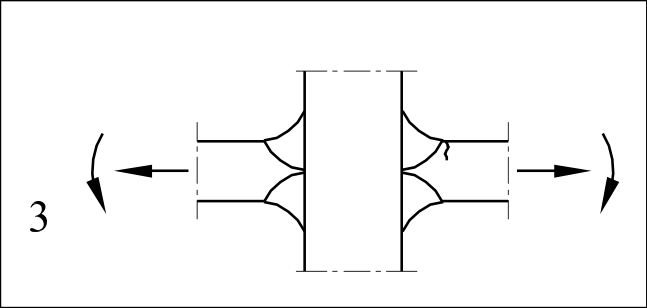

# EC3 · B.1 · dettaglio 3

[Pagina estratta](../pages/ec3-041.md) · [PDF originale](../../sources/ec3.pdf#page=41)

## Classificazione riportata

100

## Descrizione e condizioni

3) Giunzioni a croce con saldature di
testa a K a completa penetrazione.

## Requisiti e note

3)
- Angolo del piede della saldatura
≤60°.
- Per i disallineamenti vedere nota 1.

> Estrazione documentale da verificare. Le categorie non sono valori di progetto pronti per il calcolo. Celle condivise e varianti non vanno separate dalle condizioni.

## Tabella completa

