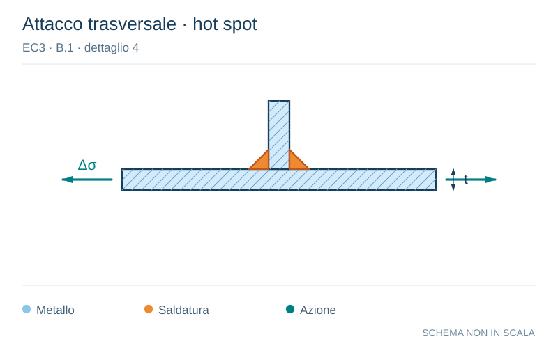

# EC3 · B.1 · dettaglio 4

[Pagina estratta](../pages/ec3-041.md) · [PDF originale](../../sources/ec3.pdf#page=41)

**Attacco trasversale · hot spot.** Disegno vettoriale non in scala. [Apri / scarica il disegno SVG](../../assets/illustrations/ec3-041-t01-d04.svg).

Il blu rappresenta gli elementi metallici, l’arancio le saldature e il turchese le azioni. Simboli e proporzioni hanno funzione schematica; classi, dimensioni limite e condizioni applicabili sono quelle riportate nella fonte.

## Classificazione riportata

100

## Descrizione e condizioni

4) Saldature a cordoni d’angolo non
soggette a carichi.

## Requisiti e note

4)
- Angolo del piede della saldatura
≤60°.
- Vedere anche nota 2.

> Estrazione documentale da verificare. Le categorie non sono valori di progetto pronti per il calcolo. Celle condivise e varianti non vanno separate dalle condizioni.

## Contesto della classificazione

[Celle della tabella in Markdown](../tables/ec3-041-t01.md) · [Tabella nel PDF di riferimento](../../sources/ec3.pdf#page=41).
