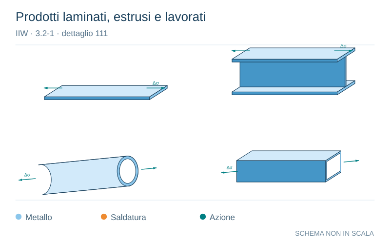

# IIW · 3.2-1 · dettaglio 111

[Pagina estratta](../pages/iiw-047.md) · [PDF originale](../../sources/iiw.pdf#page=47)

**Prodotti laminati, estrusi e lavorati.** Disegno vettoriale non in scala. [Apri / scarica il disegno SVG](../../assets/illustrations/iiw-047-t01-d01.svg).

Il blu rappresenta gli elementi metallici, l’arancio le saldature e il turchese le azioni. Simboli e proporzioni hanno funzione schematica; classi, dimensioni limite e condizioni applicabili sono quelle riportate nella fonte.

## Classificazione riportata

steel: No fatigue resistance of any detail to be higher at any
number of cycles!

Sharp edges, surface and rolling flaws to be removed
by grinding. Any machining lines or grooves to be par-
allel to stresses!

For high strength steels a higher FAT class may be used
if verified by test.; aluminium: 70
80

## Descrizione e condizioni

Rolled or extruded products, compo-
nents with machined edges, seamless
hollow sections.

        m = 5

St.:     For high strength steels a hig-
        her FAT class may be used if
         verified by test.

Al.:   AA 5000/6000 alloys
     AA 7000 alloys

## Requisiti e note

> Estrazione documentale da verificare. Le categorie non sono valori di progetto pronti per il calcolo. Celle condivise e varianti non vanno separate dalle condizioni.

## Contesto della classificazione

[Celle della tabella in Markdown](../tables/iiw-047-t01.md) · [Tabella nel PDF di riferimento](../../sources/iiw.pdf#page=47).
