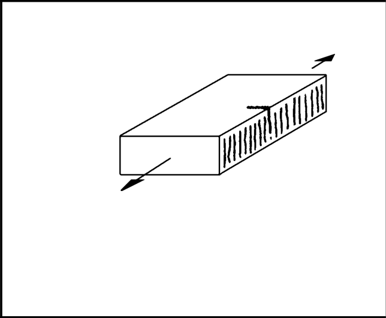

# IIW · 3.2-1 · dettaglio 121

[Pagina estratta](../pages/iiw-047.md) · [PDF originale](../../sources/iiw.pdf#page=47)

## Classificazione riportata

steel: All visible signs of edge imperfections to be removed.
The cut surfaces to be machined or ground, all burrs to
be removed.

No repair by welding refill!

Notch effects due to shape of edges have to be conside-
red.; aluminium: ---

## Descrizione e condizioni

Machine gas cut or sheared material
with subsequent dressing, no cracks by
inspection, no visible imperfections

        m = 3

## Requisiti e note

> Estrazione documentale da verificare. Le categorie non sono valori di progetto pronti per il calcolo. Celle condivise e varianti non vanno separate dalle condizioni.

## Tabella completa

