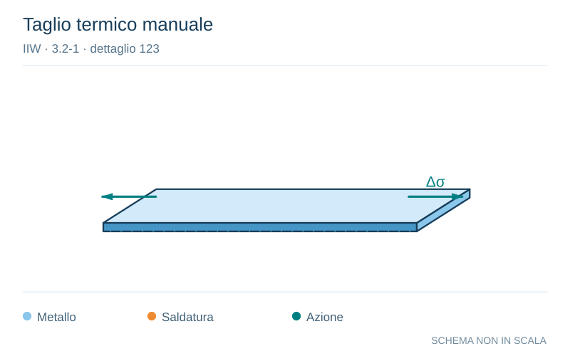

# IIW · 3.2-1 · dettaglio 123

[Pagina estratta](../pages/iiw-048.md) · [PDF originale](../../sources/iiw.pdf#page=48)

**Taglio termico manuale.** Disegno vettoriale non in scala. [Apri / scarica il disegno SVG](../../assets/illustrations/iiw-048-t01-d02.svg).

Il blu rappresenta gli elementi metallici, l’arancio le saldature e il turchese le azioni. Simboli e proporzioni hanno funzione schematica; classi, dimensioni limite e condizioni applicabili sono quelle riportate nella fonte.

## Classificazione riportata

steel: 100; aluminium: ---

## Descrizione e condizioni

Manually thermally cut edges, free
from cracks and severe notches

        m = 3

## Requisiti e note

Notch effects due to shape of edges have to be conside-
red.

> Estrazione documentale da verificare. Le categorie non sono valori di progetto pronti per il calcolo. Celle condivise e varianti non vanno separate dalle condizioni.

## Contesto della classificazione

[Celle della tabella in Markdown](../tables/iiw-048-t01.md) · [Tabella nel PDF di riferimento](../../sources/iiw.pdf#page=48).
