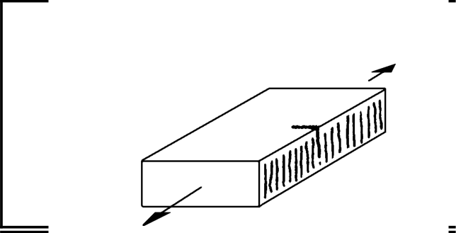
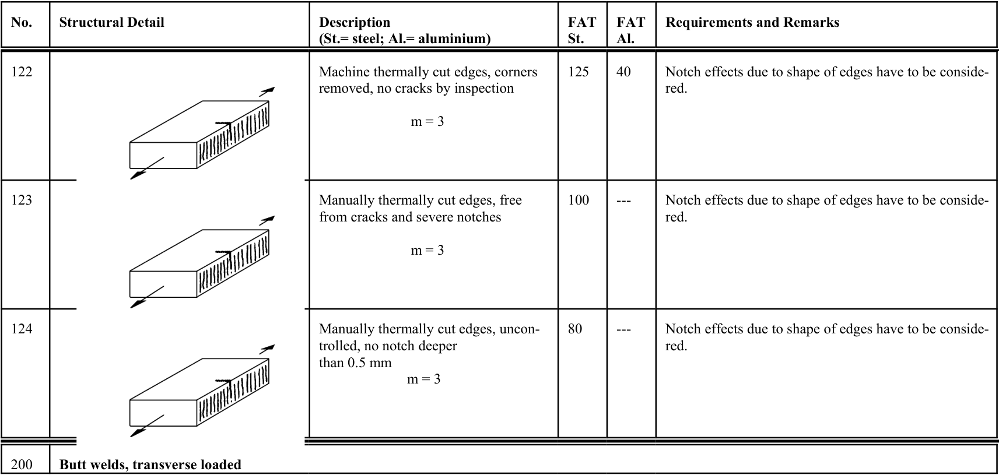

# IIW · 3.2-1 · dettaglio 124

[Pagina estratta](../pages/iiw-048.md) · [PDF originale](../../sources/iiw.pdf#page=48)

## Classificazione riportata

steel: 80; aluminium: ---

## Descrizione e condizioni

Manually thermally cut edges, uncon-
trolled, no notch deeper
than 0.5 mm
        m = 3

## Requisiti e note

Notch effects due to shape of edges have to be conside-
red.

> Estrazione documentale da verificare. Le categorie non sono valori di progetto pronti per il calcolo. Celle condivise e varianti non vanno separate dalle condizioni.

## Tabella completa

