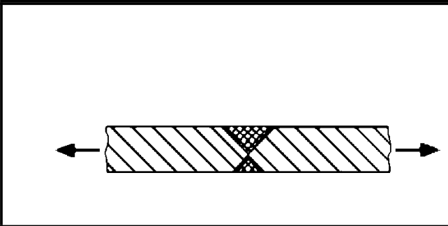
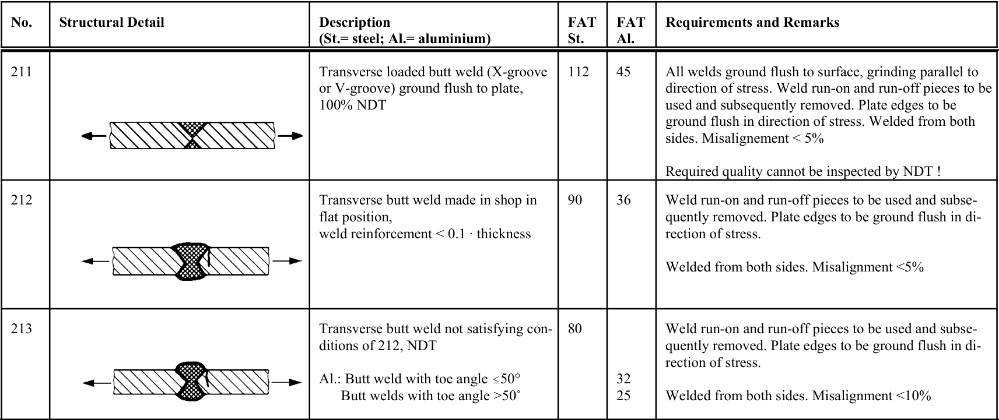

# IIW · 3.2-1 · dettaglio 211

[Pagina estratta](../pages/iiw-049.md) · [PDF originale](../../sources/iiw.pdf#page=49)

## Classificazione riportata

steel: 112; aluminium: 45

## Descrizione e condizioni

Transverse loaded butt weld (X-groove
or V-groove) ground flush to plate,
100% NDT

## Requisiti e note

All welds ground flush to surface, grinding parallel to
direction of stress. Weld run-on and run-off pieces to be
used and subsequently removed. Plate edges to be
ground flush in direction of stress. Welded from both
sides. Misalignement < 5%

Required quality cannot be inspected by NDT !

> Estrazione documentale da verificare. Le categorie non sono valori di progetto pronti per il calcolo. Celle condivise e varianti non vanno separate dalle condizioni.

## Tabella completa

