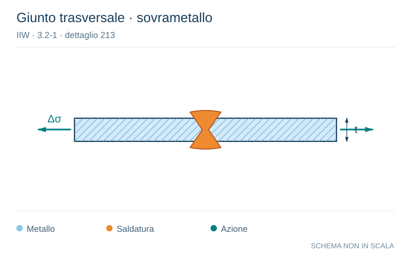

# IIW · 3.2-1 · dettaglio 213

[Pagina estratta](../pages/iiw-049.md) · [PDF originale](../../sources/iiw.pdf#page=49)

**Giunto trasversale · sovrametallo.** Disegno vettoriale non in scala. [Apri / scarica il disegno SVG](../../assets/illustrations/iiw-049-t01-d03.svg).

Il blu rappresenta gli elementi metallici, l’arancio le saldature e il turchese le azioni. Simboli e proporzioni hanno funzione schematica; classi, dimensioni limite e condizioni applicabili sono quelle riportate nella fonte.

## Classificazione riportata

steel: 80; aluminium: 32
25

## Descrizione e condizioni

Transverse butt weld not satisfying con-
ditions of 212, NDT

Al.: Butt weld with toe angle #50°
    Butt welds with toe angle >50/

## Requisiti e note

Weld run-on and run-off pieces to be used and subse-
quently removed. Plate edges to be ground flush in di-
rection of stress.

Welded from both sides. Misalignment <10%

> Estrazione documentale da verificare. Le categorie non sono valori di progetto pronti per il calcolo. Celle condivise e varianti non vanno separate dalle condizioni.

## Contesto della classificazione

[Celle della tabella in Markdown](../tables/iiw-049-t01.md) · [Tabella nel PDF di riferimento](../../sources/iiw.pdf#page=49).
