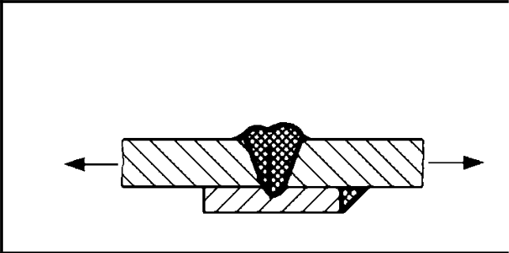
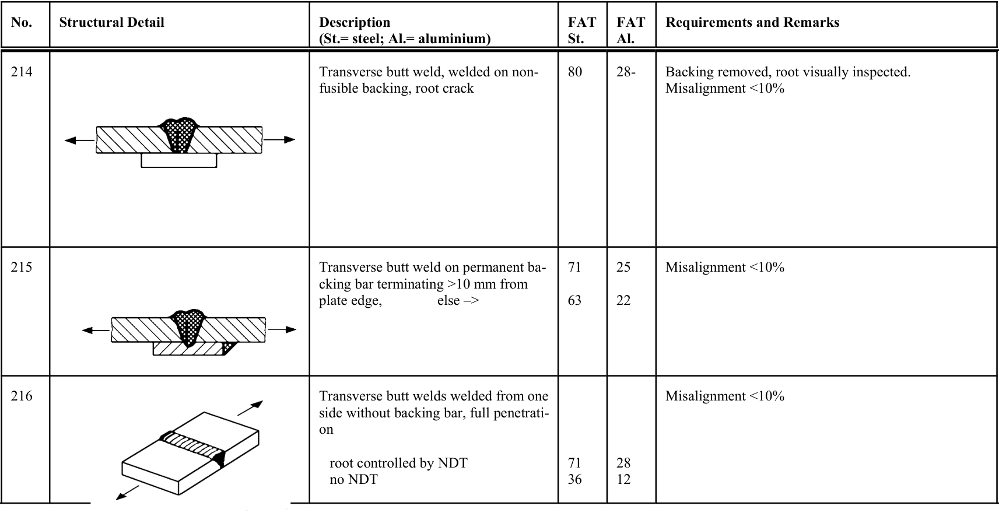

# IIW · 3.2-1 · dettaglio 215

[Pagina estratta](../pages/iiw-050.md) · [PDF originale](../../sources/iiw.pdf#page=50)

## Classificazione riportata

steel: 71

63; aluminium: 25

22

## Descrizione e condizioni

Transverse butt weld on permanent ba-
cking bar terminating >10 mm from
plate edge,          else –>

## Requisiti e note

Misalignment <10%

> Estrazione documentale da verificare. Le categorie non sono valori di progetto pronti per il calcolo. Celle condivise e varianti non vanno separate dalle condizioni.

## Tabella completa

