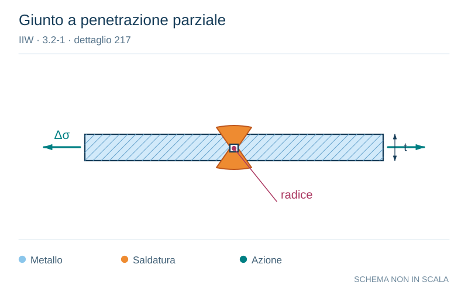

# IIW · 3.2-1 · dettaglio 217

[Pagina estratta](../pages/iiw-051.md) · [PDF originale](../../sources/iiw.pdf#page=51)

**Giunto a penetrazione parziale.** Disegno vettoriale non in scala. [Apri / scarica il disegno SVG](../../assets/illustrations/iiw-051-t01-d01.svg).

Il blu rappresenta gli elementi metallici, l’arancio le saldature e il turchese le azioni. Simboli e proporzioni hanno funzione schematica; classi, dimensioni limite e condizioni applicabili sono quelle riportate nella fonte.

## Classificazione riportata

steel: The detail is not recommended for fatigue loaded mem-
bers.

Assessment by notch stress or fracture mechanics is
preferred.; aluminium: 12

## Descrizione e condizioni

Transverse partial penetration butt
weld, analysis based on stress in weld
throat sectional area, weld overfill not
to be taken into account.

## Requisiti e note

> Estrazione documentale da verificare. Le categorie non sono valori di progetto pronti per il calcolo. Celle condivise e varianti non vanno separate dalle condizioni.

## Contesto della classificazione

[Celle della tabella in Markdown](../tables/iiw-051-t01.md) · [Tabella nel PDF di riferimento](../../sources/iiw.pdf#page=51).
