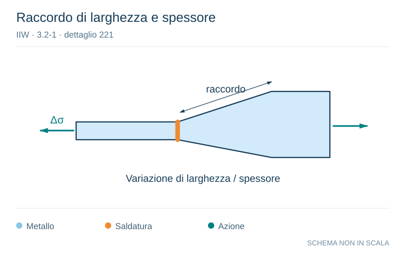

# IIW · 3.2-1 · dettaglio 221

[Pagina estratta](../pages/iiw-051.md) · [PDF originale](../../sources/iiw.pdf#page=51)

**Raccordo di larghezza e spessore.** Disegno vettoriale non in scala. [Apri / scarica il disegno SVG](../../assets/illustrations/iiw-051-t01-d02.svg).

Il blu rappresenta gli elementi metallici, l’arancio le saldature e il turchese le azioni. Simboli e proporzioni hanno funzione schematica; classi, dimensioni limite e condizioni applicabili sono quelle riportate nella fonte.

## Classificazione riportata

steel: All welds ground flush to surface, grinding paralell to
direction of stress. Weld run-on and run-off pieces to be
used and subsequently removed. Plate edges to be
ground flush in direction of stress.

Misalignment <5%

Additional misalignment due to thickness step to be
considered, see chapter 3.8.2; aluminium: 45
40
32

## Descrizione e condizioni

Transverse butt weld ground flush,
NDT, with transition in thickness and
width
        slope 1:5
        slope 1:3
        slope 1:2

## Requisiti e note

> Estrazione documentale da verificare. Le categorie non sono valori di progetto pronti per il calcolo. Celle condivise e varianti non vanno separate dalle condizioni.

## Contesto della classificazione

[Celle della tabella in Markdown](../tables/iiw-051-t01.md) · [Tabella nel PDF di riferimento](../../sources/iiw.pdf#page=51).
