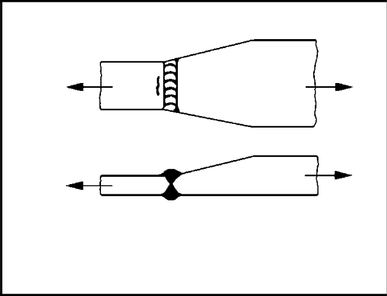

# IIW · 3.2-1 · dettaglio 222

[Pagina estratta](../pages/iiw-051.md) · [PDF originale](../../sources/iiw.pdf#page=51)

## Classificazione riportata

steel: Weld run-on and run-off pieces to be used and subse-
quently removed. Plate edges to be ground flush in di-
rection of stress.

Misalignment <10%

Additional misalignment due to thickness step to be
considered, see chapter 3.8.2; aluminium: 32
28
25

## Descrizione e condizioni

Transverse butt weld made in shop,
welded in flat position, weld profile
controlled, NDT, with transition in
thickness and width:
        slope 1:5
        slope 1:3
        slope 1:2

## Requisiti e note

> Estrazione documentale da verificare. Le categorie non sono valori di progetto pronti per il calcolo. Celle condivise e varianti non vanno separate dalle condizioni.

## Tabella completa

