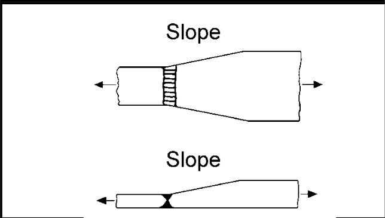

# IIW · 3.2-1 · dettaglio 223

[Pagina estratta](../pages/iiw-052.md) · [PDF originale](../../sources/iiw.pdf#page=52)

## Classificazione riportata

steel: 80
71
63; aluminium: 25
22
20

## Descrizione e condizioni

Transverse butt weld, NDT, with transi-
tion on thickness and width
        slope 1:5
        slope 1:3
        slope 1:2

## Requisiti e note

Weld run-on and run-off pieces to be used and subse-
quently removed. Plate edges to be ground flush in di-
rection of stress.

Misalignment <10%

Additional misalignments due to thickness step to be
considered, see chapter 3.8.2

> Estrazione documentale da verificare. Le categorie non sono valori di progetto pronti per il calcolo. Celle condivise e varianti non vanno separate dalle condizioni.

## Tabella completa

