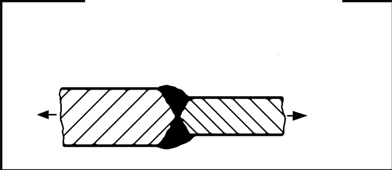

# IIW · 3.2-1 · dettaglio 224

[Pagina estratta](../pages/iiw-052.md) · [PDF originale](../../sources/iiw.pdf#page=52)

## Classificazione riportata

steel: 71; aluminium: 22

## Descrizione e condizioni

Transverse butt weld, different thick-
nesses without transition,
centres aligned.
In cases, where weld profile is equiva-
lent to a moderate slope transition, see
no. 222

## Requisiti e note

Misalignment <10% of smaller plate thickness

> Estrazione documentale da verificare. Le categorie non sono valori di progetto pronti per il calcolo. Celle condivise e varianti non vanno separate dalle condizioni.

## Tabella completa

