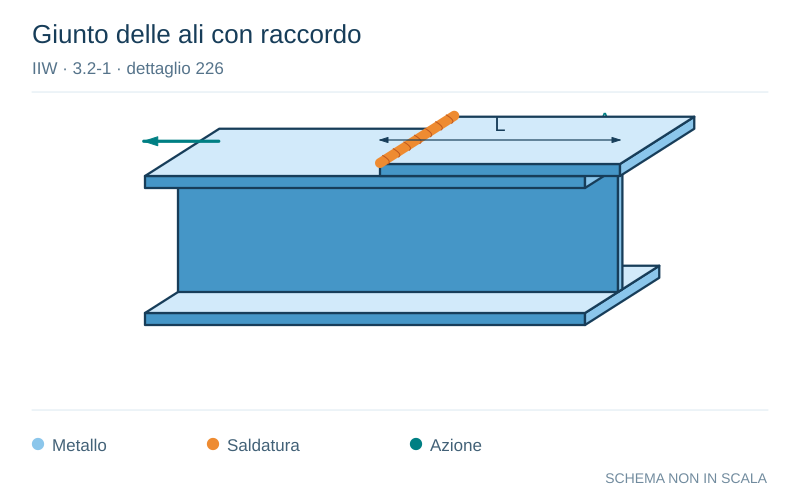

# IIW · 3.2-1 · dettaglio 226

[Pagina estratta](../pages/iiw-053.md) · [PDF originale](../../sources/iiw.pdf#page=53)

**Giunto delle ali con raccordo.** Disegno vettoriale non in scala. [Apri / scarica il disegno SVG](../../assets/illustrations/iiw-053-t01-d01.svg).

Il blu rappresenta gli elementi metallici, l’arancio le saldature e il turchese le azioni. Simboli e proporzioni hanno funzione schematica; classi, dimensioni limite e condizioni applicabili sono quelle riportate nella fonte.

## Classificazione riportata

steel: 100; aluminium: 40

## Descrizione e condizioni

Transverse butt weld flange splice in
built-up section welded prior to the as-
sembly, ground flush, with radius tran-
sition, NDT

## Requisiti e note

All welds ground flush to surface, grinding paralell to
direction of stress. Weld run-on and run-off pieces to be
used and subsequently removed. Plate edges to be
ground flush in direction of stress.

> Estrazione documentale da verificare. Le categorie non sono valori di progetto pronti per il calcolo. Celle condivise e varianti non vanno separate dalle condizioni.

## Contesto della classificazione

[Celle della tabella in Markdown](../tables/iiw-053-t01.md) · [Tabella nel PDF di riferimento](../../sources/iiw.pdf#page=53).
