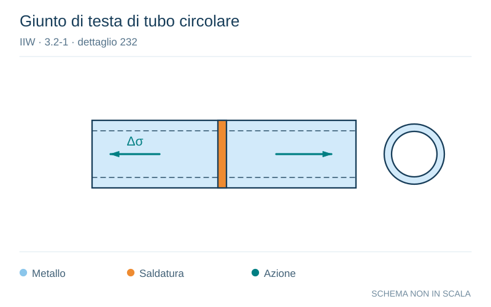

# IIW · 3.2-1 · dettaglio 232

[Pagina estratta](../pages/iiw-053.md) · [PDF originale](../../sources/iiw.pdf#page=53)

**Giunto di testa di tubo circolare.** Disegno vettoriale non in scala. [Apri / scarica il disegno SVG](../../assets/illustrations/iiw-053-t01-d03.svg).

Il blu rappresenta gli elementi metallici, l’arancio le saldature e il turchese le azioni. Simboli e proporzioni hanno funzione schematica; classi, dimensioni limite e condizioni applicabili sono quelle riportate nella fonte.

## Classificazione riportata

steel: 71
36; aluminium: 28
12

## Descrizione e condizioni

Transverse butt weld splice in circular
hollow section, welded from one side,
full penetration, root crack

         root inspected by NDT
       no NDT

## Requisiti e note

Welded in flat position.

> Estrazione documentale da verificare. Le categorie non sono valori di progetto pronti per il calcolo. Celle condivise e varianti non vanno separate dalle condizioni.

## Contesto della classificazione

[Celle della tabella in Markdown](../tables/iiw-053-t01.md) · [Tabella nel PDF di riferimento](../../sources/iiw.pdf#page=53).
