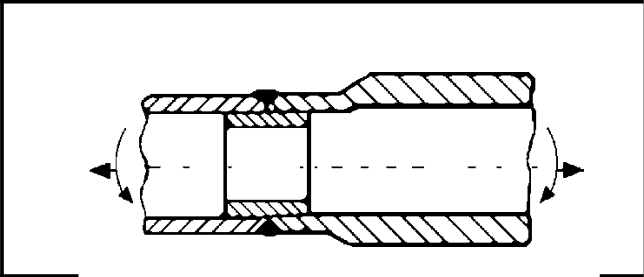

# IIW · 3.2-1 · dettaglio 233

[Pagina estratta](../pages/iiw-053.md) · [PDF originale](../../sources/iiw.pdf#page=53)

## Classificazione riportata

steel: 71; aluminium: 28

## Descrizione e condizioni

Tubular joint with permanent backing

## Requisiti e note

Welded in flat position.

> Estrazione documentale da verificare. Le categorie non sono valori di progetto pronti per il calcolo. Celle condivise e varianti non vanno separate dalle condizioni.

## Tabella completa

