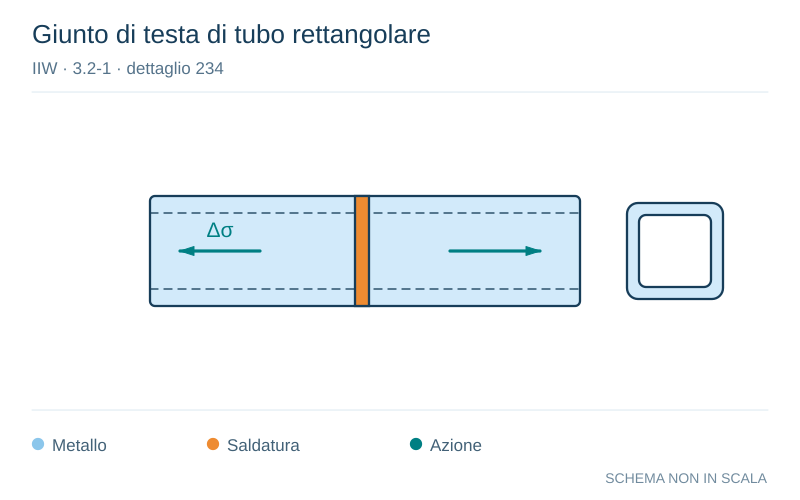

# IIW · 3.2-1 · dettaglio 234

[Pagina estratta](../pages/iiw-054.md) · [PDF originale](../../sources/iiw.pdf#page=54)

**Giunto di testa di tubo rettangolare.** Disegno vettoriale non in scala. [Apri / scarica il disegno SVG](../../assets/illustrations/iiw-054-t01-d01.svg).

Il blu rappresenta gli elementi metallici, l’arancio le saldature e il turchese le azioni. Simboli e proporzioni hanno funzione schematica; classi, dimensioni limite e condizioni applicabili sono quelle riportate nella fonte.

## Classificazione riportata

steel: 56
36; aluminium: 25
12

## Descrizione e condizioni

Transverse butt weld splice in rectan-
gular hollow section, welded from one
side, full penetration, root crack

         root inspected by NDT
       no NDT

## Requisiti e note

Welded in flat position.

> Estrazione documentale da verificare. Le categorie non sono valori di progetto pronti per il calcolo. Celle condivise e varianti non vanno separate dalle condizioni.

## Contesto della classificazione

[Celle della tabella in Markdown](../tables/iiw-054-t01.md) · [Tabella nel PDF di riferimento](../../sources/iiw.pdf#page=54).
