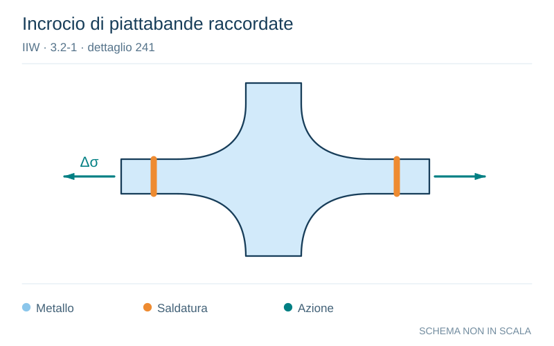

# IIW · 3.2-1 · dettaglio 241

[Pagina estratta](../pages/iiw-054.md) · [PDF originale](../../sources/iiw.pdf#page=54)

**Incrocio di piattabande raccordate.** Disegno vettoriale non in scala. [Apri / scarica il disegno SVG](../../assets/illustrations/iiw-054-t01-d02.svg).

Il blu rappresenta gli elementi metallici, l’arancio le saldature e il turchese le azioni. Simboli e proporzioni hanno funzione schematica; classi, dimensioni limite e condizioni applicabili sono quelle riportate nella fonte.

## Classificazione riportata

steel: 100; aluminium: 40

## Descrizione e condizioni

Transverse butt weld ground flush,
weld ends and radius ground, 100%
NDT at crossing flanges, radius transiti-
on.

## Requisiti e note

All welds ground flush to surface, grinding paralell to
direction of stress. Weld run-on and run-off pieces to be
used and subsequently removed. Plate edges to be
ground flush in direction of stress.

Welded from both sides. No misalignment. Required
weld quality cannot be inspected by NDT

> Estrazione documentale da verificare. Le categorie non sono valori di progetto pronti per il calcolo. Celle condivise e varianti non vanno separate dalle condizioni.

## Contesto della classificazione

[Celle della tabella in Markdown](../tables/iiw-054-t01.md) · [Tabella nel PDF di riferimento](../../sources/iiw.pdf#page=54).
