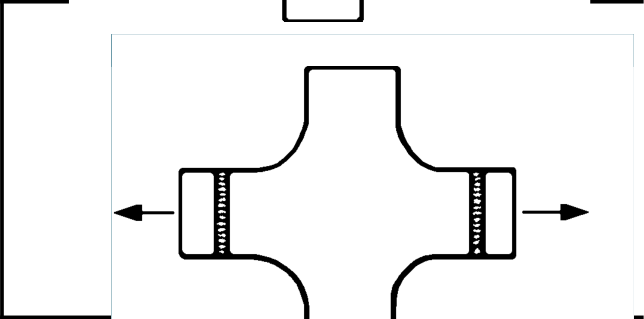

# IIW · 3.2-1 · dettaglio 242

[Pagina estratta](../pages/iiw-054.md) · [PDF originale](../../sources/iiw.pdf#page=54)

## Classificazione riportata

steel: 90; aluminium: 36

## Descrizione e condizioni

Transverse butt weld made in shop at
flat position, weld profile controlled,
NDT, at crossing flanges, radius transi-
tion

## Requisiti e note

Weld run-on and run-off pieces to be used and subse-
quently removed. Plate edges to be ground flush in di-
rection of stress.

Welded from both sides.Misalignment <5%

> Estrazione documentale da verificare. Le categorie non sono valori di progetto pronti per il calcolo. Celle condivise e varianti non vanno separate dalle condizioni.

## Tabella completa

