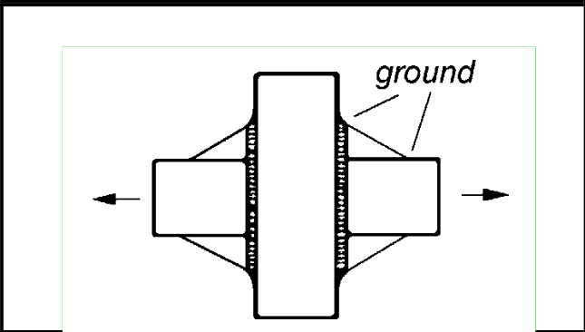
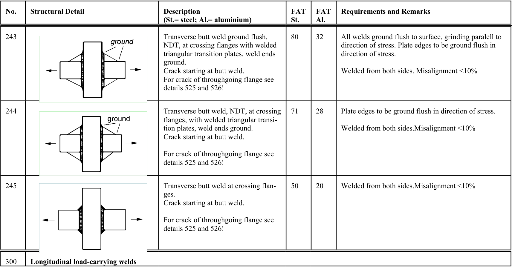

# IIW · 3.2-1 · dettaglio 243

[Pagina estratta](../pages/iiw-055.md) · [PDF originale](../../sources/iiw.pdf#page=55)

## Classificazione riportata

steel: 80; aluminium: 32

## Descrizione e condizioni

Transverse butt weld ground flush,
NDT, at crossing flanges with welded
triangular transition plates, weld ends
ground.
Crack starting at butt weld.
For crack of throughgoing flange see
details 525 and 526!

## Requisiti e note

All welds ground flush to surface, grinding paralell to
direction of stress. Plate edges to be ground flush in
direction of stress.

Welded from both sides. Misalignment <10%

> Estrazione documentale da verificare. Le categorie non sono valori di progetto pronti per il calcolo. Celle condivise e varianti non vanno separate dalle condizioni.

## Tabella completa

