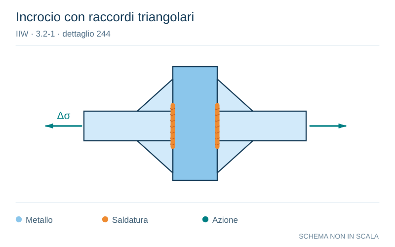

# IIW · 3.2-1 · dettaglio 244

[Pagina estratta](../pages/iiw-055.md) · [PDF originale](../../sources/iiw.pdf#page=55)

**Incrocio con raccordi triangolari.** Disegno vettoriale non in scala. [Apri / scarica il disegno SVG](../../assets/illustrations/iiw-055-t01-d02.svg).

Il blu rappresenta gli elementi metallici, l’arancio le saldature e il turchese le azioni. Simboli e proporzioni hanno funzione schematica; classi, dimensioni limite e condizioni applicabili sono quelle riportate nella fonte.

## Classificazione riportata

steel: 71; aluminium: 28

## Descrizione e condizioni

Transverse butt weld, NDT, at crossing
flanges, with welded triangular transi-
tion plates, weld ends ground.
Crack starting at butt weld.

For crack of throughgoing flange see
details 525 and 526!

## Requisiti e note

Plate edges to be ground flush in direction of stress.

Welded from both sides.Misalignment <10%

> Estrazione documentale da verificare. Le categorie non sono valori di progetto pronti per il calcolo. Celle condivise e varianti non vanno separate dalle condizioni.

## Contesto della classificazione

[Celle della tabella in Markdown](../tables/iiw-055-t01.md) · [Tabella nel PDF di riferimento](../../sources/iiw.pdf#page=55).
