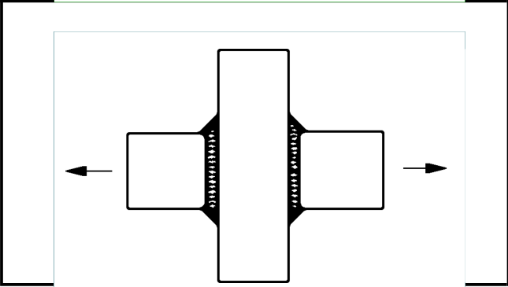

# IIW · 3.2-1 · dettaglio 245

[Pagina estratta](../pages/iiw-055.md) · [PDF originale](../../sources/iiw.pdf#page=55)

## Classificazione riportata

steel: 50; aluminium: 20

## Descrizione e condizioni

Transverse butt weld at crossing flan-
ges.
Crack starting at butt weld.

For crack of throughgoing flange see
details 525 and 526!

## Requisiti e note

Welded from both sides.Misalignment <10%

> Estrazione documentale da verificare. Le categorie non sono valori di progetto pronti per il calcolo. Celle condivise e varianti non vanno separate dalle condizioni.

## Tabella completa

