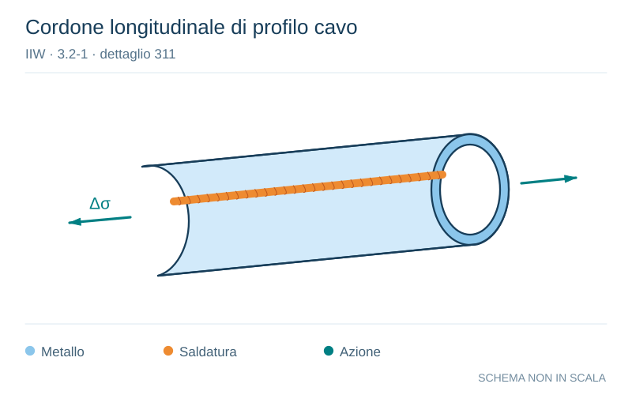

# IIW · 3.2-1 · dettaglio 311

[Pagina estratta](../pages/iiw-056.md) · [PDF originale](../../sources/iiw.pdf#page=56)

**Cordone longitudinale di profilo cavo.** Disegno vettoriale non in scala. [Apri / scarica il disegno SVG](../../assets/illustrations/iiw-056-t01-d01.svg).

Il blu rappresenta gli elementi metallici, l’arancio le saldature e il turchese le azioni. Simboli e proporzioni hanno funzione schematica; classi, dimensioni limite e condizioni applicabili sono quelle riportate nella fonte.

## Classificazione riportata

steel: 125

90; aluminium: 50

36

## Descrizione e condizioni

Automatic longitudinal seam welds wit-
hout stop/start positions in hollow sec-
tions

with stop/start positions

## Requisiti e note

> Estrazione documentale da verificare. Le categorie non sono valori di progetto pronti per il calcolo. Celle condivise e varianti non vanno separate dalle condizioni.

## Contesto della classificazione

[Celle della tabella in Markdown](../tables/iiw-056-t01.md) · [Tabella nel PDF di riferimento](../../sources/iiw.pdf#page=56).
