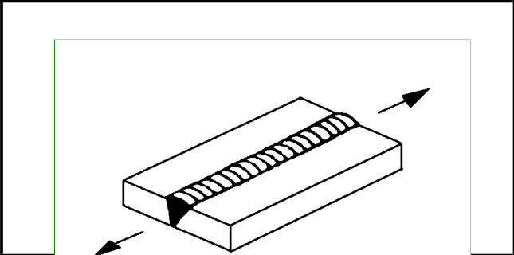

# IIW · 3.2-1 · dettaglio 312

[Pagina estratta](../pages/iiw-056.md) · [PDF originale](../../sources/iiw.pdf#page=56)

## Classificazione riportata

steel: 125; aluminium: 50

## Descrizione e condizioni

Longitudinal butt weld, both sides
ground flush parallel to load direction

## Requisiti e note

> Estrazione documentale da verificare. Le categorie non sono valori di progetto pronti per il calcolo. Celle condivise e varianti non vanno separate dalle condizioni.

## Tabella completa

