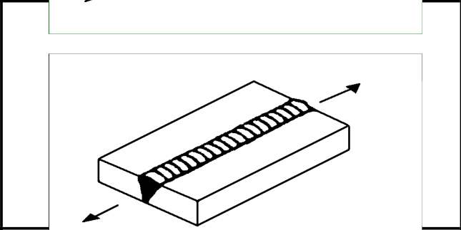

# IIW · 3.2-1 · dettaglio 313

[Pagina estratta](../pages/iiw-056.md) · [PDF originale](../../sources/iiw.pdf#page=56)

## Classificazione riportata

steel: 125

90; aluminium: 50

36

## Descrizione e condizioni

Longitudinal butt weld, without
stop/start positions, NDT

with stop/start positions

## Requisiti e note

> Estrazione documentale da verificare. Le categorie non sono valori di progetto pronti per il calcolo. Celle condivise e varianti non vanno separate dalle condizioni.

## Tabella completa

