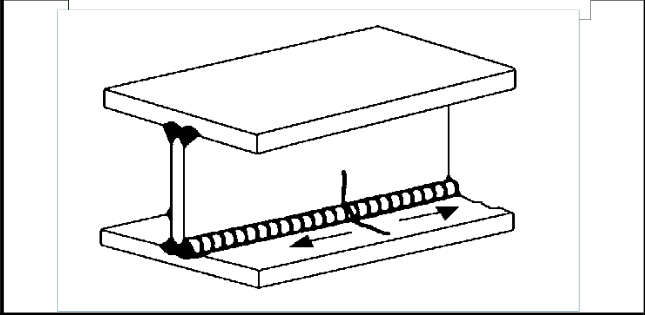
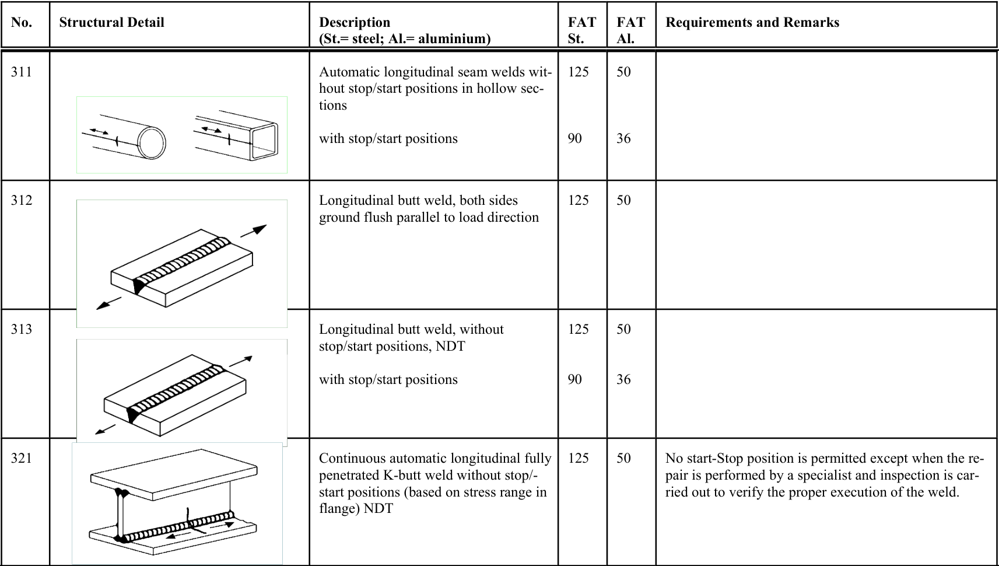

# IIW · 3.2-1 · dettaglio 321

[Pagina estratta](../pages/iiw-056.md) · [PDF originale](../../sources/iiw.pdf#page=56)

## Classificazione riportata

steel: 125; aluminium: 50

## Descrizione e condizioni

Continuous automatic longitudinal fully
penetrated K-butt weld without stop/-
start positions (based on stress range in
flange) NDT

## Requisiti e note

No start-Stop position is permitted except when the re-
pair is performed by a specialist and inspection is car-
ried out to verify the proper execution of the weld.

> Estrazione documentale da verificare. Le categorie non sono valori di progetto pronti per il calcolo. Celle condivise e varianti non vanno separate dalle condizioni.

## Tabella completa

