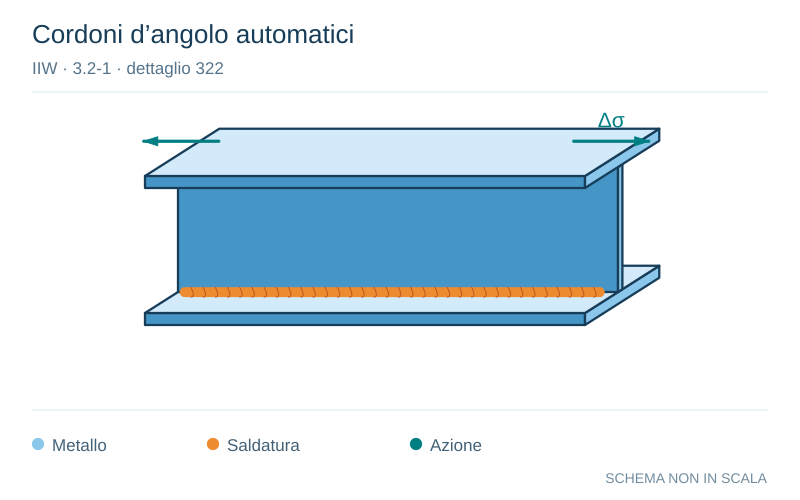

# IIW · 3.2-1 · dettaglio 322

[Pagina estratta](../pages/iiw-057.md) · [PDF originale](../../sources/iiw.pdf#page=57)

**Cordoni d’angolo automatici.** Disegno vettoriale non in scala. [Apri / scarica il disegno SVG](../../assets/illustrations/iiw-057-t01-d01.svg).

Il blu rappresenta gli elementi metallici, l’arancio le saldature e il turchese le azioni. Simboli e proporzioni hanno funzione schematica; classi, dimensioni limite e condizioni applicabili sono quelle riportate nella fonte.

## Classificazione riportata

steel: 100; aluminium: 40

## Descrizione e condizioni

Continuous automatic longitudinal dou-
ble sided fillet weld without stop/start
positions (based on stress range in flan-
ge)

## Requisiti e note

Discussion: EC3 has 112 ??

> Estrazione documentale da verificare. Le categorie non sono valori di progetto pronti per il calcolo. Celle condivise e varianti non vanno separate dalle condizioni.

## Contesto della classificazione

[Celle della tabella in Markdown](../tables/iiw-057-t01.md) · [Tabella nel PDF di riferimento](../../sources/iiw.pdf#page=57).
