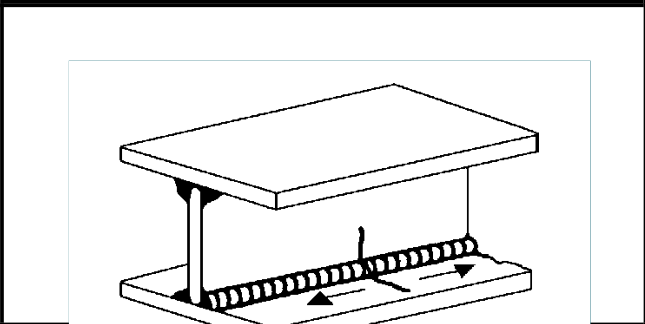

# IIW · 3.2-1 · dettaglio 322

[Pagina estratta](../pages/iiw-057.md) · [PDF originale](../../sources/iiw.pdf#page=57)

## Classificazione riportata

steel: 100; aluminium: 40

## Descrizione e condizioni

Continuous automatic longitudinal dou-
ble sided fillet weld without stop/start
positions (based on stress range in flan-
ge)

## Requisiti e note

Discussion: EC3 has 112 ??

> Estrazione documentale da verificare. Le categorie non sono valori di progetto pronti per il calcolo. Celle condivise e varianti non vanno separate dalle condizioni.

## Tabella completa

