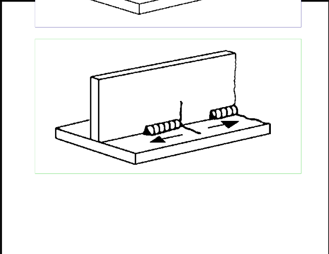
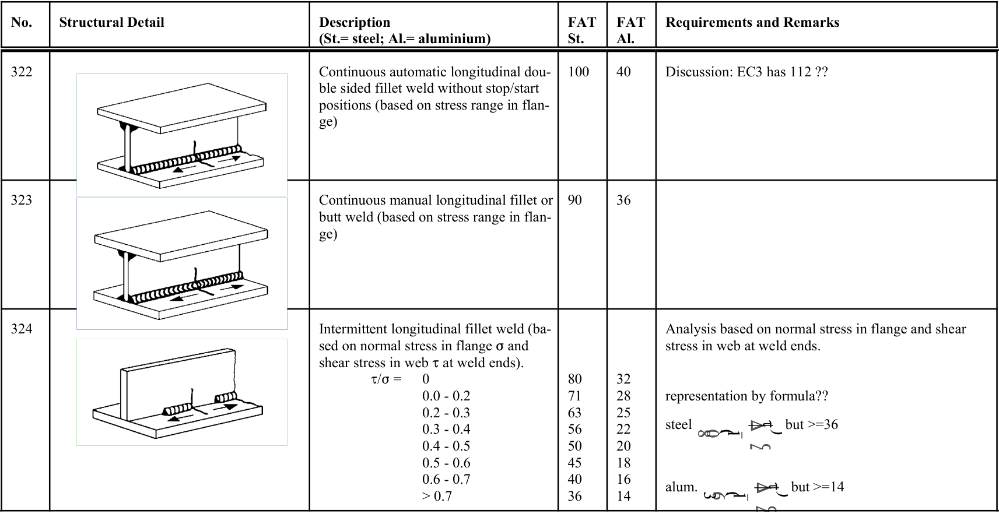

# IIW · 3.2-1 · dettaglio 324

[Pagina estratta](../pages/iiw-057.md) · [PDF originale](../../sources/iiw.pdf#page=57)

## Classificazione riportata

steel: 80
71
63
56
50
45
40
36; aluminium: 32
28
25
22
20
18
16
14

## Descrizione e condizioni

Intermittent longitudinal fillet weld (ba-
sed on normal stress in flange F and
shear stress in web J at weld ends).
        J/F =   0
                 0.0 - 0.2
                 0.2 - 0.3
                 0.3 - 0.4
                 0.4 - 0.5
                 0.5 - 0.6
                 0.6 - 0.7
             > 0.7

## Requisiti e note

Analysis based on normal stress in flange and shear
stress in web at weld ends.

representation by formula??

steel               but >=36

alum.               but >=14

> Estrazione documentale da verificare. Le categorie non sono valori di progetto pronti per il calcolo. Celle condivise e varianti non vanno separate dalle condizioni.

## Tabella completa

