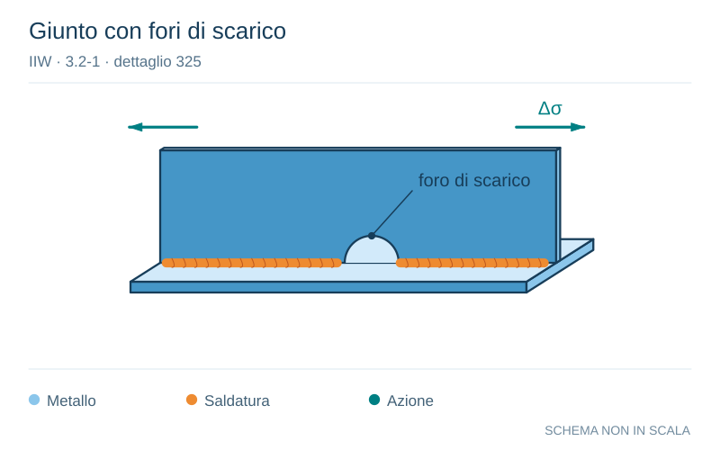

# IIW · 3.2-1 · dettaglio 325

[Pagina estratta](../pages/iiw-058.md) · [PDF originale](../../sources/iiw.pdf#page=58)

**Giunto con fori di scarico.** Disegno vettoriale non in scala. [Apri / scarica il disegno SVG](../../assets/illustrations/iiw-058-t01-d01.svg).

Il blu rappresenta gli elementi metallici, l’arancio le saldature e il turchese le azioni. Simboli e proporzioni hanno funzione schematica; classi, dimensioni limite e condizioni applicabili sono quelle riportate nella fonte.

## Classificazione riportata

steel: 71
63
56
50
45
40
36; aluminium: 28
25
22
20
18
16
14

## Descrizione e condizioni

Longitudinal butt weld, fillet weld or
intermittent weld with cope holes (ba-
sed on normal stress in flange F and
shear stress in web J at weld ends), co-
pe holes not higher than 40% of web.
        J/F =   0
                 0.0 - 0.2
                 0.2 - 0.3
                 0.3 - 0.4
                 0.4 - 0.5
                 0.5 - 0.6
             > 0.6

## Requisiti e note

Analysis based on normal stress in flange and shear
stress in web at weld ends.

representation by formula??

steel               but >=36

alum.               but >=14

> Estrazione documentale da verificare. Le categorie non sono valori di progetto pronti per il calcolo. Celle condivise e varianti non vanno separate dalle condizioni.

## Contesto della classificazione

[Celle della tabella in Markdown](../tables/iiw-058-t01.md) · [Tabella nel PDF di riferimento](../../sources/iiw.pdf#page=58).
