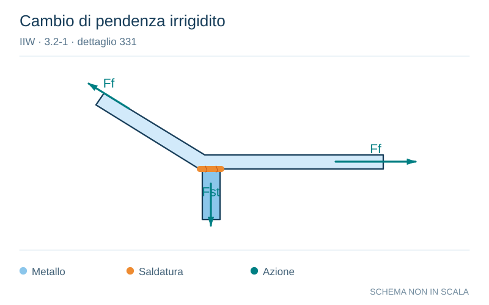

# IIW · 3.2-1 · dettaglio 331

[Pagina estratta](../pages/iiw-059.md) · [PDF originale](../../sources/iiw.pdf#page=59)

**Cambio di pendenza irrigidito.** Disegno vettoriale non in scala. [Apri / scarica il disegno SVG](../../assets/illustrations/iiw-059-t01-d01.svg).

Il blu rappresenta gli elementi metallici, l’arancio le saldature e il turchese le azioni. Simboli e proporzioni hanno funzione schematica; classi, dimensioni limite e condizioni applicabili sono quelle riportate nella fonte.

## Classificazione riportata

steel: ---; aluminium: ---

## Descrizione e condizioni

Joint at stiffened knuckle of a flange to
be assessed according to no. 411 - 414,
depending on type of joint.

Stress in stiffener plate:

        Af = area of flange
         ASt = area of stiffener

Stress in weld throat:

      Aw = area of weld throat

## Requisiti e note

> Estrazione documentale da verificare. Le categorie non sono valori di progetto pronti per il calcolo. Celle condivise e varianti non vanno separate dalle condizioni.

## Contesto della classificazione

[Celle della tabella in Markdown](../tables/iiw-059-t01.md) · [Tabella nel PDF di riferimento](../../sources/iiw.pdf#page=59).
