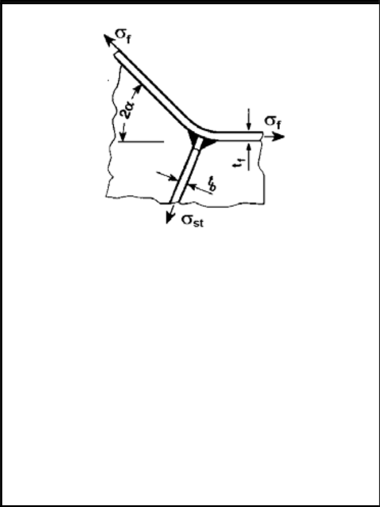
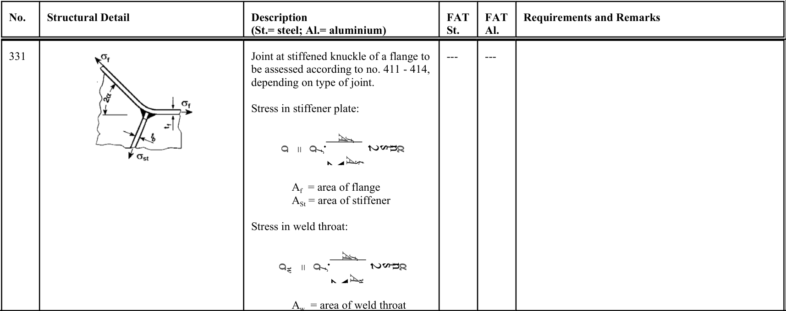

# IIW · 3.2-1 · dettaglio 331

[Pagina estratta](../pages/iiw-059.md) · [PDF originale](../../sources/iiw.pdf#page=59)

## Classificazione riportata

steel: ---; aluminium: ---

## Descrizione e condizioni

Joint at stiffened knuckle of a flange to
be assessed according to no. 411 - 414,
depending on type of joint.

Stress in stiffener plate:

        Af = area of flange
         ASt = area of stiffener

Stress in weld throat:

      Aw = area of weld throat

## Requisiti e note

> Estrazione documentale da verificare. Le categorie non sono valori di progetto pronti per il calcolo. Celle condivise e varianti non vanno separate dalle condizioni.

## Tabella completa

