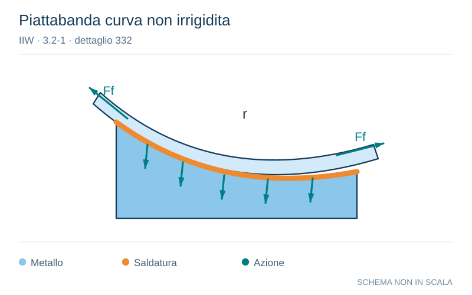

# IIW · 3.2-1 · dettaglio 332

[Pagina estratta](../pages/iiw-060.md) · [PDF originale](../../sources/iiw.pdf#page=60)

**Piattabanda curva non irrigidita.** Disegno vettoriale non in scala. [Apri / scarica il disegno SVG](../../assets/illustrations/iiw-060-t01-d01.svg).

Il blu rappresenta gli elementi metallici, l’arancio le saldature e il turchese le azioni. Simboli e proporzioni hanno funzione schematica; classi, dimensioni limite e condizioni applicabili sono quelle riportate nella fonte.

## Classificazione riportata

steel: ---; aluminium: ---

## Descrizione e condizioni

Unstiffened curved flange to web joint,
to be assessed according to no. 411 -
414, depending on type of joint.

Stress in web plate:

Stress in weld throat:

Ff axial force in flange
t thickness of web plate
a weld throat

## Requisiti e note

The resulting force of Ff-left and Ff-right will bend the
flange perpenticular to the plane of main loading. In
oder to minimize this additional stressing of the welds,
it is recommended to minimize the width and to maxi-
mize the thickness of the flange.

Stress longitudinally to the weld is to be considered. At
additional shear, principle stress in web is to be consi-
red (see 321 to 323)

> Estrazione documentale da verificare. Le categorie non sono valori di progetto pronti per il calcolo. Celle condivise e varianti non vanno separate dalle condizioni.

## Contesto della classificazione

[Celle della tabella in Markdown](../tables/iiw-060-t01.md) · [Tabella nel PDF di riferimento](../../sources/iiw.pdf#page=60).
