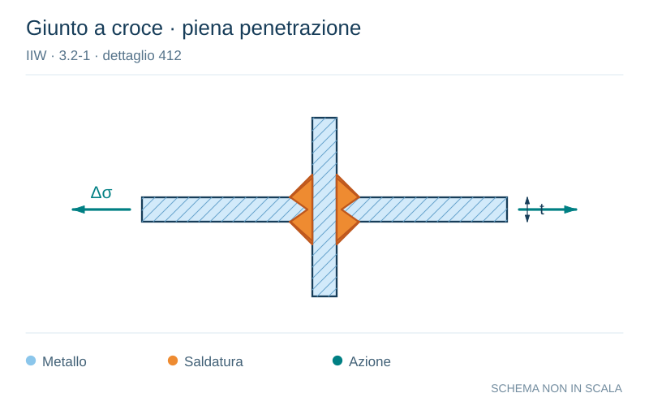

# IIW · 3.2-1 · dettaglio 412

[Pagina estratta](../pages/iiw-061.md) · [PDF originale](../../sources/iiw.pdf#page=61)

**Giunto a croce · piena penetrazione.** Disegno vettoriale non in scala. [Apri / scarica il disegno SVG](../../assets/illustrations/iiw-061-t01-d01.svg).

Il blu rappresenta gli elementi metallici, l’arancio le saldature e il turchese le azioni. Simboli e proporzioni hanno funzione schematica; classi, dimensioni limite e condizioni applicabili sono quelle riportate nella fonte.

## Classificazione riportata

steel: 71

80; aluminium: 25

28

## Descrizione e condizioni

Cruciform joint or T-joint, K-butt
welds, full penetration, no lamellar tea-
ring, misalignment e<0.15At, toe crack

Single sided T-joints and cruciform
joints without misalignment

## Requisiti e note

Material quality of intermediate plate has to be checked
against susceptibility of lamellar tearing.

Misalignment <15% of loaded plate.

> Estrazione documentale da verificare. Le categorie non sono valori di progetto pronti per il calcolo. Celle condivise e varianti non vanno separate dalle condizioni.

## Contesto della classificazione

[Celle della tabella in Markdown](../tables/iiw-061-t01.md) · [Tabella nel PDF di riferimento](../../sources/iiw.pdf#page=61).
