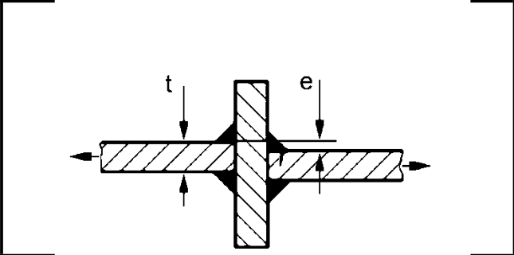

# IIW · 3.2-1 · dettaglio 413

[Pagina estratta](../pages/iiw-061.md) · [PDF originale](../../sources/iiw.pdf#page=61)

## Classificazione riportata

steel: 63; aluminium: 22

## Descrizione e condizioni

Cruciform joint or T-joint, fillet welds
or partial penetration K-butt welds, no
lamellar tearing, misalignment e<0.15At,
toe crack

## Requisiti e note

Material quality of intermediate plate has to be checked
against susceptibility of lamellar tearing.

Misalignment <15% of loaded plate.

Also to be assessed as 414

> Estrazione documentale da verificare. Le categorie non sono valori di progetto pronti per il calcolo. Celle condivise e varianti non vanno separate dalle condizioni.

## Tabella completa

