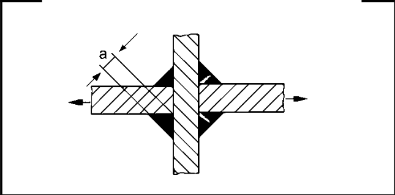

# IIW · 3.2-1 · dettaglio 414

[Pagina estratta](../pages/iiw-061.md) · [PDF originale](../../sources/iiw.pdf#page=61)

## Classificazione riportata

steel: 36

40; aluminium: 12

14

## Descrizione e condizioni

Cruciform joint or T-joint, fillet welds
or partial penetration K-butt welds in-
cluding toe ground joints,
weld root crack.
For a/t<=1/3

## Requisiti e note

Analysis based on stress in weld throat Also to bes as-
sessed as 413.

Ratio a/t is calculated from weld throat over wall thick-
nes

> Estrazione documentale da verificare. Le categorie non sono valori di progetto pronti per il calcolo. Celle condivise e varianti non vanno separate dalle condizioni.

## Tabella completa

