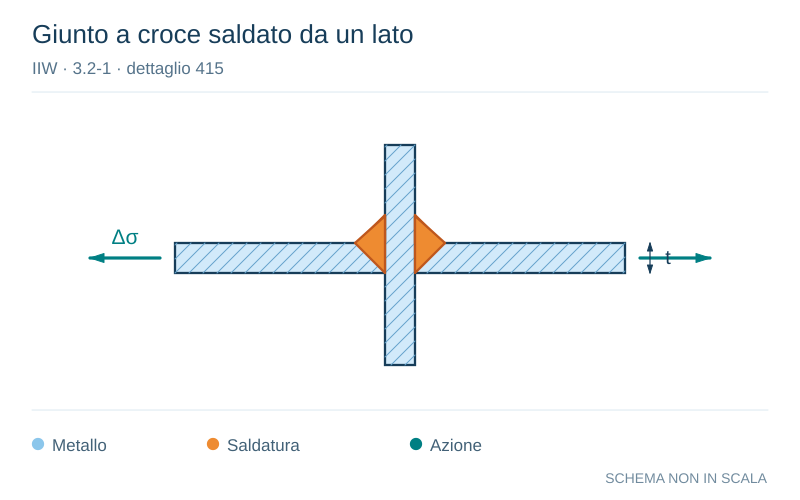

# IIW · 3.2-1 · dettaglio 415

[Pagina estratta](../pages/iiw-061.md) · [PDF originale](../../sources/iiw.pdf#page=61)

**Giunto a croce saldato da un lato.** Disegno vettoriale non in scala. [Apri / scarica il disegno SVG](../../assets/illustrations/iiw-061-t01-d04.svg).

Il blu rappresenta gli elementi metallici, l’arancio le saldature e il turchese le azioni. Simboli e proporzioni hanno funzione schematica; classi, dimensioni limite e condizioni applicabili sono quelle riportate nella fonte.

## Classificazione riportata

steel: 71

36; aluminium: 25

12

## Descrizione e condizioni

Cruciform joint or T-joint, single-sided
arc or laser beam welded V-butt weld,
full penetration, no lamellar tearing,
misalignment e< 0.15At, toe crack. Root
inspected.

If root is not inspected, then root crack

## Requisiti e note

> Estrazione documentale da verificare. Le categorie non sono valori di progetto pronti per il calcolo. Celle condivise e varianti non vanno separate dalle condizioni.

## Contesto della classificazione

[Celle della tabella in Markdown](../tables/iiw-061-t01.md) · [Tabella nel PDF di riferimento](../../sources/iiw.pdf#page=61).
