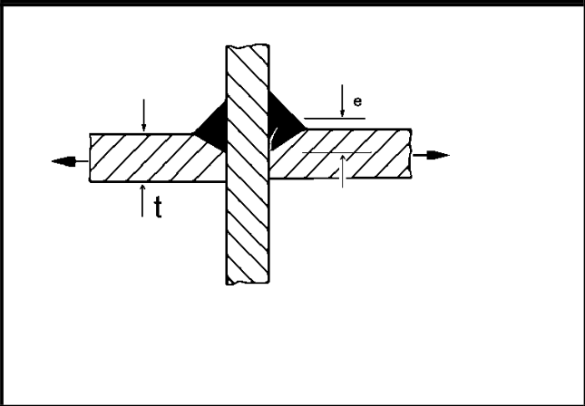

# IIW · 3.2-1 · dettaglio 416

[Pagina estratta](../pages/iiw-062.md) · [PDF originale](../../sources/iiw.pdf#page=62)

## Classificazione riportata

steel: 71

36; aluminium: 25

12

## Descrizione e condizioni

Cruciform joint or T-joint, single-sided
arc welded fillet or partial penetration
Y-butt weld, no lamellar tearing,
misalignment of plates e< 0.15At, stress
at weld root. Penetration verified.

Penetration not verified.

## Requisiti e note

Analysis based on stress in weld root. Excentricity e of
plate t and weld throat a midpoints to be considered in
analysis. Stress at weld root:

)F w, root = )F w, nom A (1+6e/a)

e = excentricity between plate and weld throat a

An analysis by effective notch stress procedure is re-
commended

> Estrazione documentale da verificare. Le categorie non sono valori di progetto pronti per il calcolo. Celle condivise e varianti non vanno separate dalle condizioni.

## Tabella completa

