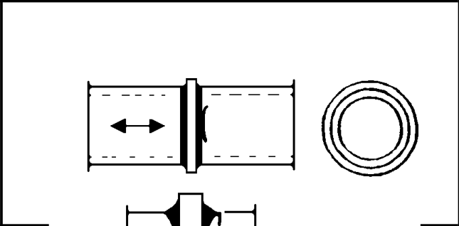
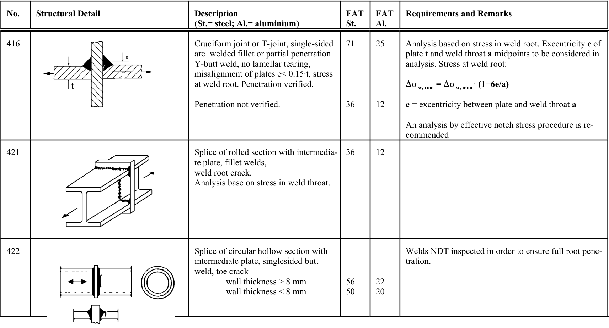

# IIW · 3.2-1 · dettaglio 422

[Pagina estratta](../pages/iiw-062.md) · [PDF originale](../../sources/iiw.pdf#page=62)

## Classificazione riportata

steel: 56
50; aluminium: 22
20

## Descrizione e condizioni

Splice of circular hollow section with
intermediate plate, singlesided butt
weld, toe crack
        wall thickness > 8 mm
        wall thickness < 8 mm

## Requisiti e note

Welds NDT inspected in order to ensure full root pene-
tration.

> Estrazione documentale da verificare. Le categorie non sono valori di progetto pronti per il calcolo. Celle condivise e varianti non vanno separate dalle condizioni.

## Tabella completa

