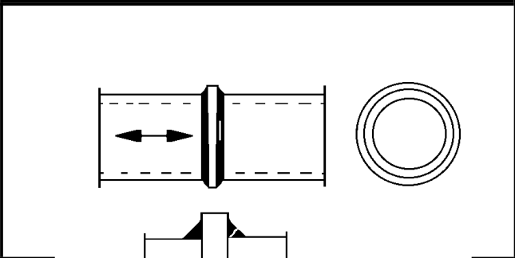

# IIW · 3.2-1 · dettaglio 423

[Pagina estratta](../pages/iiw-063.md) · [PDF originale](../../sources/iiw.pdf#page=63)

## Classificazione riportata

steel: 45
40; aluminium: 16
14

## Descrizione e condizioni

Splice of circular hollow section with
intermediate plate, fillet weld, root
crack. Analysis based on stress in weld
throat.

        wall thickness > 8 mm
        wall thickness < 8 mm

## Requisiti e note

> Estrazione documentale da verificare. Le categorie non sono valori di progetto pronti per il calcolo. Celle condivise e varianti non vanno separate dalle condizioni.

## Tabella completa

